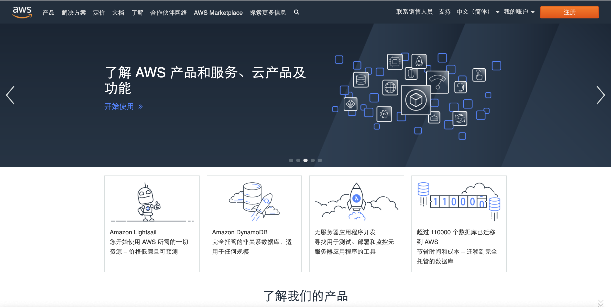
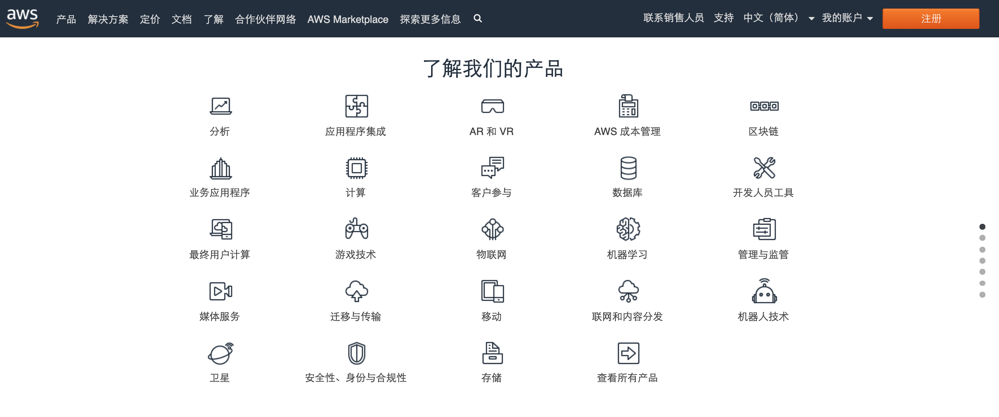
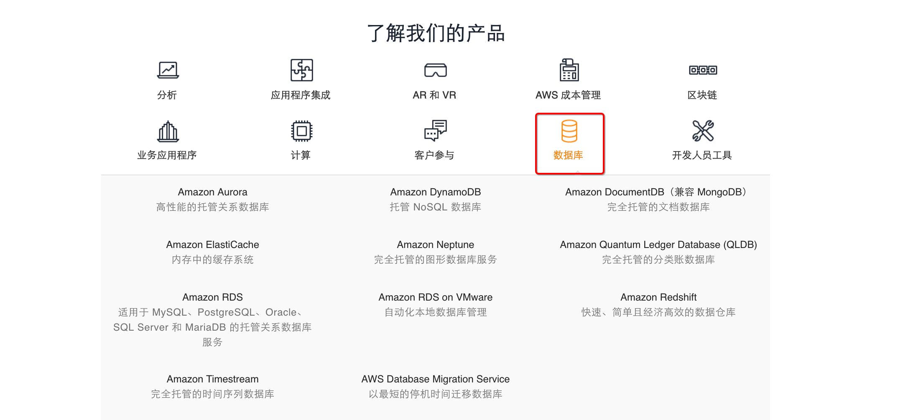

# 1-3-1 服务和类别概念

## AWS Services and Categories

在本模块中，我们将介绍 AWS 的服务和类别，以及一些关于 AWS 文档的信息。

AWS 提供了一系列广泛的基于云的全球产品，可用作常见云架构的构建块。每个产品都提供许多不同的服务。我们将在本模块中讨论一些类别，包括: **计算**、**存储**、**数据库**、**联网**和**安全性**。

## 一、AWS 首页

现在，我要打开浏览器来进入 aws.amazon.com 网站。这是我们的首页。

## 二、AWS 产品

往下滑动一点，就可以看到`了解我们的产品`部分，此处列有不同类别下的所有产品和服务：

### 2.1 AWS产品 - 计算\(Compute\)

单击 `计算/(Compute)` ，就可以看到位于列表中第一个的 **Amazon EC2**，但计算类别下还有很多其他产品和服务。

如果单击 **【Amazon EC2】**，就会转到 Amazon EC2 的首页，URL 是 [https://amazonaws-china.com/cn/ec2/](https://amazonaws-china.com/cn/ec2/)。

页面中提供了一些关于产品的简要介绍、更详细的描述，并列出了一些优势。此外，在这一行，我们可以看到产品详细信息、实例类型、定价、入门、常见问题和其他资源。

### 2.2 AWS  产品 - 存储

返回首页，单击 **【存储/\(Storage\)】**，然后在 `存储（Storage`）下，我们会看到 **Amazon S3、Amazon EBS** 等。这里还将显示很多其他存储选项。

### 2.3 AWS 产品 - 数据库

在**【数据库/DataBase】**下，可以看到 **Aurora**、**Amazon RDS**、**Amazon DynamoDB**、**Amazon Redshift** 和一些其它选项。

