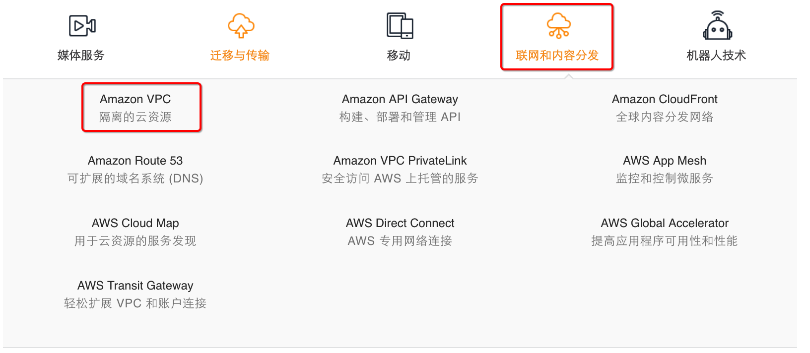

# 1-3-1-4 联网

如果我们想要查找 **`Amazon VPC`**，实际上它显示在 **【网络和内容分发/Networking & Content Delivery】**下。

* **Amazon VPC: 隔离的云资源**
* Amazon API Gateway: 构建、部署和管理 API
* Amazon CloudFront: 全球内容分发网络
* Amazon Route 53： 可扩展的域名系统\(DNS\)
* AMazon VPC PrivateLink: 安全访问 AWS 上托管的服务
* AWS App Mesh: 监控和控制微服务
* AWS Cloud Map: 用于云资源的服务发现
* AWS Direct Connect: AWS 专用网络连接
* AWS Global Accelerator: 提高英语程序可用性和性能
* AWS Transit Gateway: 轻松扩展 VPC 和账户连接

