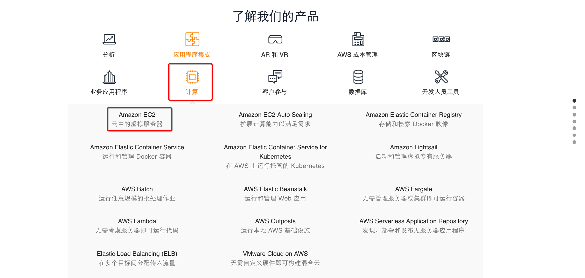
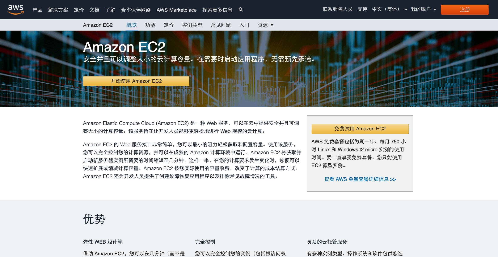

# 1-3-1-1 计算

单击 **`计算/(Compute)`**，就可以看到位于列表中第一个的 **Amazon EC2**，但计算类别下还有很多其他产品和服务。

* **Amazon EC2: 云中的虚拟服务器**
* **Amazon EC2 Auto Scaling: 扩展计算能力以满足需求**
* Amazon Elastic Container Registry: 存储和检索 Docker 映像
* Amazon Elastic Container Service: 运行和管理 Docker 容器
* Amazon Elastic Container Service for Kubernetes: 在 AWS 上运行托管 Kubernetes
* Amazon Lightsail: 应用和管理虚拟专有服务器
* Amazon Batch: 运行任意规模的批处理作业
* **Amazon Elastic Beanstalk: 运行和管理 Web 应用**
* AWS Fargate: 无需管理服务器或集群即可运行容器
* **AWS Lambda: 无需考虑服务器即可运行代码**
* AWS Outposts: 运行本地 AWS 基础设施
* AWS Serverless Application Repository: 发现、部署和发布无服务应用程序
* **Elastic Load Balance\(ELB\): 在多个目标间分配传入流量**
* VMware Cloud on AWS: 无需自定义硬件即可以构建混合云

如果单击 **【Amazon EC2】**，就会转到 Amazon EC2 的首页，URL 是 [https://amazonaws-china.com/cn/ec2/](https://amazonaws-china.com/cn/ec2/)。

页面中提供了一些关于产品的简要介绍、更详细的描述，并列出了一些优势。此外，在这一行，我们可以看到产品详细信息、实例类型、定价、入门、常见问题和其他资源。

