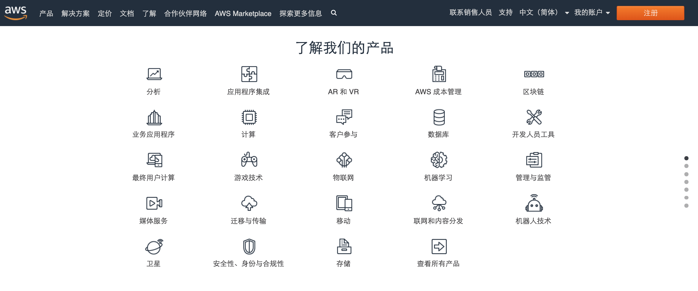

# 1-3-1 服务和类别概念

## AWS Services and Categories

在本模块中，我们将介绍 AWS 的服务和类别，以及一些关于 AWS 文档的信息。

AWS 提供了一系列广泛的基于云的全球产品，可用作常见云架构的构建块。每个产品都提供许多不同的服务。我们将在本模块中讨论一些类别，包括: **计算**、**存储**、**数据库**、**联网**和**安全性**。

## AWS 首页

现在，我要打开浏览器来进入 aws.amazon.com 网站。这是我们的首页。

## AWS 产品

往下滑动一点，就可以看到`了解我们的产品`部分，此处列有不同类别下的所有产品和服务：

